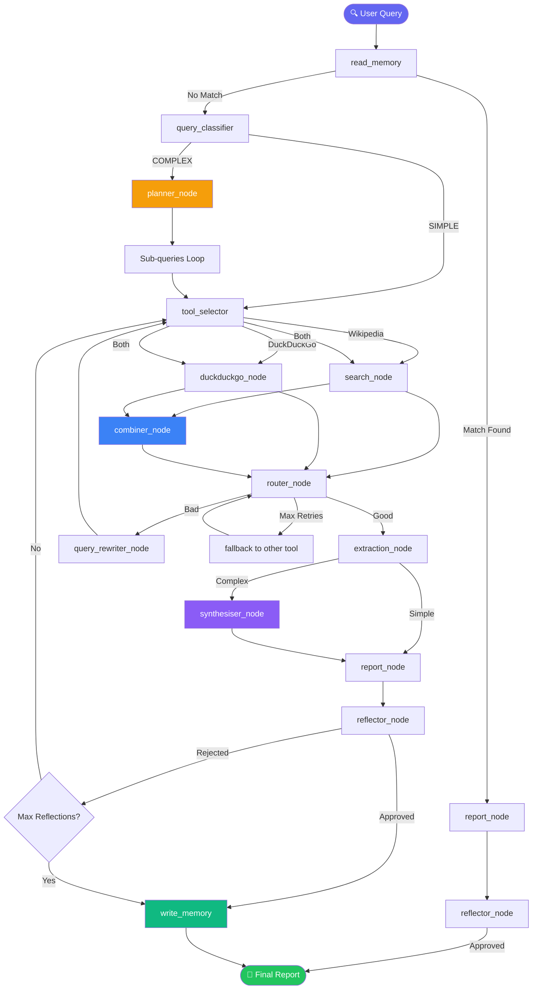

# 🔍 Zyven - Agentic Research Assistant

A locally-running multi-node research agent powered by Mistral via Ollama. Give it any topic and it intelligently classifies complexity, selects tools, searches multiple sources, rewrites failed queries, remembers past research, and generates a full structured report — entirely on your own machine.

---

## How It Works



---

## Nodes

| Node | File | What it does |
|---|---|---|
| Memory (Read) | `nodes/memory.py` | Checks if query matches past research — skips search if yes |
| Query Classifier | `nodes/query_classifier.py` | LLM detects if query is SIMPLE or COMPLEX |
| Planner | `nodes/planner.py` | Breaks complex queries into 3 focused sub-queries |
| Tool Selector | `nodes/tool_selector.py` | LLM decides: Wikipedia, DuckDuckGo, or Both |
| Search | `nodes/search.py` | Fetches Wikipedia page using LLM-based candidate matching |
| DuckDuckGo | `nodes/duckduckgo.py` | Searches the web for recent or practical topics |
| Combiner | `nodes/combiner.py` | Merges Wikipedia and DuckDuckGo results into one source |
| Router | `nodes/router.py` | Judges if search results are good enough to proceed |
| Query Rewriter | `nodes/query_rewriter.py` | LLM rewrites a failed query to get better results |
| Extractor | `nodes/extractor.py` | Extracts key facts from search results |
| Synthesiser | `nodes/synthesiser.py` | Combines findings from all sub-queries into unified notes |
| Reporter | `nodes/reporter.py` | Writes a full structured research report |
| Memory (Write) | `nodes/memory.py` | Saves query + notes to memory.json for future sessions |

---

## Requirements

- Python 3.9+
- [Ollama](https://ollama.com/) running locally with Mistral pulled
- Internet connection for Wikipedia and DuckDuckGo search

---

## Setup

**1. Clone the repo**
```bash
git clone https://github.com/tanushbuilds/agentic-research-assistant.git
cd agentic-research-assistant
```

**2. Install dependencies**
```bash
pip install ollama wikipedia-api wikipedia ddgs
```

**3. Pull Mistral**
```bash
ollama pull mistral
```

**4. Run**
```bash
python main.py
```

---

## Example

```
Enter your research topic: Compare careers of Cristiano Ronaldo and Lionel Messi

Query Complexity: COMPLEX
Sub-queries: ['Ronaldo career stats', 'Messi career stats', 'Compare Ronaldo Messi careers']

Tool selected: Both
Searching both tools...
Combined Wikipedia and DuckDuckGo results!

[repeats for each sub-query]

Memory saved for: 'Compare careers of Cristiano Ronaldo and Lionel Messi'

=== FINAL REPORT ===
...

--- Second run ---

Enter your research topic: Ronaldo vs Messi
Memory match found: 'Compare careers of Cristiano Ronaldo and Lionel Messi'! Skipping search...
```

---

## Agentic Features

| Feature | Status |
|---|---|
| LLM-based tool selection | ✅ |
| Multi-source search + combining | ✅ |
| Result quality judgement | ✅ |
| Query rewriting on failure | ✅ |
| Fallback between tools | ✅ |
| Complexity detection | ✅ |
| Plan and Execute pattern | ✅ |
| Semantic memory across sessions | ✅ |
| Error handling with fallbacks | ✅ |

---

## Built With

- [Ollama](https://ollama.com/) — Local LLM inference
- [Mistral](https://mistral.ai/) — Language model
- [Wikipedia-API](https://pypi.org/project/Wikipedia-API/) — Wikipedia page fetching
- [wikipedia](https://pypi.org/project/wikipedia/) — Wikipedia candidate search
- [ddgs](https://pypi.org/project/ddgs/) — DuckDuckGo web search

---

## Roadmap

- [ ] Report quality self-reflection
- [ ] LangGraph implementation
- [ ] Django web UI

---

<sub>Built by [@tanushbuilds](https://github.com/tanushbuilds) · 14 year old developer</sub>
