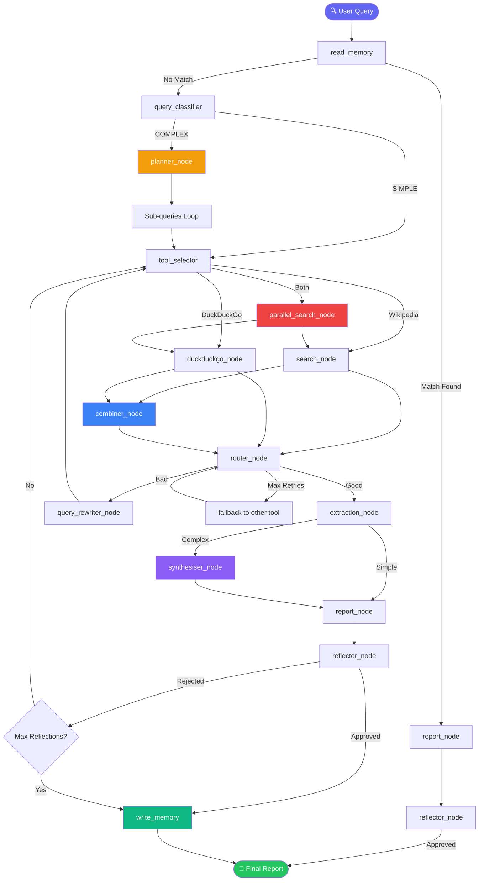

# 🔍 Zyven - Agentic Research Assistant

A multi-node agentic research assistant powered by a modular LLM provider system. Give it any topic and it intelligently classifies complexity, selects tools, searches multiple sources, rewrites failed queries, remembers past research, and generates a full structured 5000+ word report — entirely for free.

---

## How It Works


```mermaid
flowchart TD
    A([🔍 User Query]) --> B[read_memory]
    B -->|Match Found| C[report_node]
    C --> D[reflector_node]
    D -->|Approved| E([📄 Final Report])
    B -->|No Match| F[query_classifier]

    F -->|SIMPLE| G[tool_selector]
    F -->|COMPLEX| H[planner_node]

    H --> I[Sub-queries Loop]
    I --> G

    G -->|Wikipedia| J[search_node]
    G -->|DuckDuckGo| K[duckduckgo_node]
    G -->|Both| PS[parallel_search_node]

    PS --> J
    PS --> K
    J --> L[combiner_node]
    K --> L

    J --> M[router_node]
    K --> M
    L --> M

    M -->|Good| N[extraction_node]
    M -->|Bad| O[query_rewriter_node]
    O --> G

    M -->|Max Retries| P[fallback to other tool]
    P --> M

    N -->|Simple| Q[report_node]
    N -->|Complex| R[synthesiser_node]
    R --> Q

    Q --> S[reflector_node]
    S -->|Approved| T[write_memory]
    T --> E
    S -->|Rejected| U{Max Reflections?}
    U -->|No| G
    U -->|Yes| T

    style A fill:#6366f1,color:#fff
    style E fill:#22c55e,color:#fff
    style H fill:#f59e0b,color:#fff
    style PS fill:#ef4444,color:#fff
    style L fill:#3b82f6,color:#fff
    style R fill:#8b5cf6,color:#fff
    style T fill:#10b981,color:#fff
```

---

## Nodes

| Node | File | What it does |
|---|---|---|
| Memory (Read) | `nodes/memory.py` | Checks if query matches past research — skips search if yes |
| Query Classifier | `nodes/query_classifier.py` | LLM detects if query is SIMPLE or COMPLEX |
| Planner | `nodes/planner.py` | Breaks complex queries into 3 focused sub-queries |
| Tool Selector | `nodes/tool_selector.py` | LLM decides: Wikipedia, DuckDuckGo, or Both |
| Search | `nodes/search.py` | Fetches Wikipedia page using LLM-based candidate matching |
| DuckDuckGo | `nodes/duckduckgo.py` | Searches the web for recent or practical topics |
| Combiner | `nodes/combiner.py` | Merges Wikipedia and DuckDuckGo results into one source |
| Router | `nodes/router.py` | Judges if search results are good enough to proceed |
| Query Rewriter | `nodes/query_rewriter.py` | LLM rewrites a failed query to get better results |
| Extractor | `nodes/extractor.py` | Extracts key facts from search results |
| Synthesiser | `nodes/synthesiser.py` | Combines findings from all sub-queries into unified notes |
| Reporter | `nodes/reporter.py` | Writes a full structured research report |
| Memory (Write) | `nodes/memory.py` | Saves query + notes to memory.json for future sessions |

---

## Modular LLM Provider System

All nodes use a centralised `llm_client.py` module — no provider logic lives inside individual nodes. Switching providers requires changing a single line in `.env`.

```
ACTIVE_PROVIDER=gemini   # or groq
```

| Provider | Fast Model | Smart Model | RPD |
|---|---|---|---|
| `gemini` | `gemini-2.5-flash` | `gemini-2.5-flash` | 20 (free tier) |
| `groq` | `llama-3.1-8b-instant` | `llama-3.3-70b-versatile` | Generous free tier |

Nodes are split into two tiers:

| Tier | Nodes | Why |
|---|---|---|
| `fast` | Classifier, Router, Reflector, Planner, Tool Selector, Memory | Short outputs, low token usage |
| `smart` | Extraction, Synthesiser, Reporter | Heavy tasks requiring depth and quality |

---

## Performance

| | Before (Mistral local) | After (Cloud API) |
|---|---|---|
| Speed | 5–10 mins | Under 2 mins |
| Report length | 500 words | 5000+ words |
| Hardware required | 4GB VRAM minimum | None |
| Cost | Free (local) | Free (API) |

---

## Requirements

- Python 3.9+
- API key for at least one supported provider (Google AI Studio or Groq)
- Internet connection

---

## Setup

**1. Clone the repo**
```bash
git clone https://github.com/tanushbuilds/agentic-researcher.git
cd agentic-researcher
```

**2. Install dependencies**
```bash
pip install openai python-dotenv wikipedia-api wikipedia ddgs
```

**3. Add your API keys**

Create a `.env` file in the project root:
```
ACTIVE_PROVIDER=gemini

GEMINI_API_KEY=your_gemini_key_here
GROQ_API_KEY=your_groq_key_here
```

Get a free Gemini key at [aistudio.google.com](https://aistudio.google.com) — no credit card required.

Get a free Groq key at [console.groq.com](https://console.groq.com) — no credit card required.

**4. Run**
```bash
python main.py
```

---

## Switching Providers

To switch from Gemini to Groq (or back), change one line in `.env`:

```
ACTIVE_PROVIDER=groq
```

Restart the server. Every node switches instantly — no code changes required.

---

## Example Output

```
Enter your research topic: Virat Kohli

Query Complexity: SIMPLE
Tool selected: Both
Searching Wikipedia and DuckDuckGo...

Memory saved for: 'Virat Kohli'

=== FINAL REPORT ===
# Comprehensive Research Report: The Illustrious Career of Virat Kohli...
[5000+ word report generated in under 2 minutes]

--- Second run ---

Enter your research topic: Kohli cricket career
Memory match found: 'Virat Kohli'! Skipping search...
```

---

## Agentic Features

| Feature | Status |
|---|---|
| LLM-based tool selection | ✅ |
| Multi-source search + combining | ✅ |
| Result quality judgement | ✅ |
| Query rewriting on failure | ✅ |
| Fallback between tools | ✅ |
| Complexity detection | ✅ |
| Plan and Execute pattern | ✅ |
| Semantic memory across sessions | ✅ |
| Error handling with fallbacks | ✅ |
| Cloud LLM inference (no GPU needed) | ✅ |
| Modular provider switching via .env | ✅ |

---

## Built With

- [Google Gemini API](https://ai.google.dev/) — Primary LLM provider
- [Groq](https://groq.com/) — Fallback LLM provider
- [OpenAI Python SDK](https://github.com/openai/openai-python) — OpenAI-compatible client
- [Wikipedia-API](https://pypi.org/project/Wikipedia-API/) — Wikipedia page fetching
- [wikipedia](https://pypi.org/project/wikipedia/) — Wikipedia candidate search
- [ddgs](https://pypi.org/project/ddgs/) — DuckDuckGo web search

---

## Roadmap

- [ ] PDF export of reports
- [ ] LangGraph implementation

---

<sub>Built by [@tanushbuilds](https://github.com/tanushbuilds) · 14 year old developer</sub>
