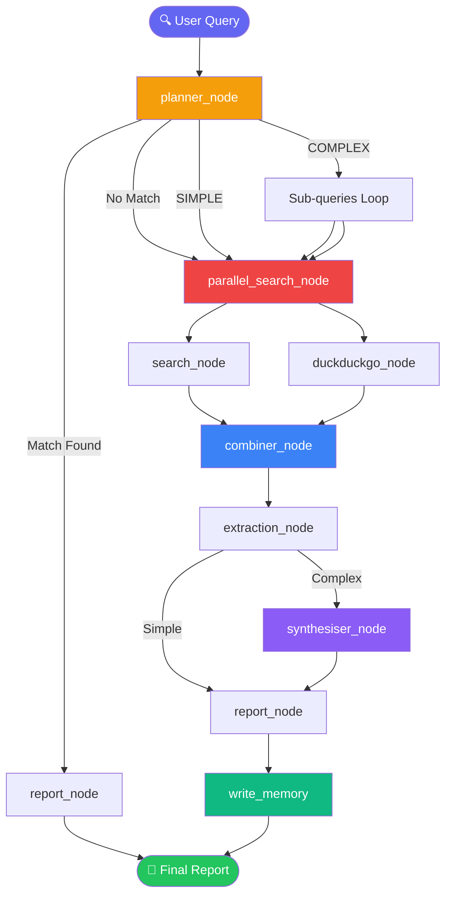

# 🔍 Zyven - Agentic Research Assistant

A locally-running multi-node research agent powered by Gemini and Groq via their APIs. Give it any topic and it intelligently classifies complexity, plans sub-queries, scrapes both Wikipedia and DuckDuckGo, remembers past research, and generates a full structured report — entirely on your own machine.

---

## How It Works


```mermaid
flowchart TD
    A([🔍 User Query]) --> F[planner_node]
    F -->|Match Found| C[report_node]
    C --> E([📄 Final Report])
    F -->|No Match| PS[parallel_search_node]

    F -->|SIMPLE| PS[parallel_search_node]
    F -->|COMPLEX| I[Sub-queries Loop]
    I --> PS
    I --> PS

    PS --> J[search_node]
    PS --> K[duckduckgo_node]
    J --> L[combiner_node]
    K --> L

    L --> N[extraction_node]

    N -->|Simple| Q[report_node]
    N -->|Complex| R[synthesiser_node]
    R --> Q

    Q --> T[write_memory]
    T --> E

    style A fill:#6366f1,color:#fff
    style E fill:#22c55e,color:#fff
    style F fill:#f59e0b,color:#fff
    style PS fill:#ef4444,color:#fff
    style L fill:#3b82f6,color:#fff
    style R fill:#8b5cf6,color:#fff
    style T fill:#10b981,color:#fff
```

---

## Nodes

| Node | File | What it does |
|---|---|---|
| Planner | `nodes/planner.py` | Checks memory for past research; if none, classifies query and breaks complex ones into sub-queries |
| Parallel Search | `nodes/parallel_search.py` | Triggers Wikipedia and DuckDuckGo searches simultaneously |
| Search | `nodes/search.py` | Fetches Wikipedia page using LLM-based candidate matching |
| DuckDuckGo | `nodes/duckduckgo.py` | Searches the web for recent or practical topics |
| Combiner | `nodes/combiner.py` | Merges Wikipedia and DuckDuckGo results into one source |
| Extractor | `nodes/extractor.py` | Extracts key facts from combined search results |
| Synthesiser | `nodes/synthesiser.py` | Combines findings from all sub-queries into unified notes |
| Reporter | `nodes/reporter.py` | Writes a full structured research report |
| Memory (Write) | `nodes/memory.py` | Saves query + notes to memory.json for future sessions |

---

## Requirements

- Python 3.9+
- Gemini or Groq API key
- Internet connection for Wikipedia and DuckDuckGo search

---

## Setup

**1. Clone the repo**
```bash
git clone https://github.com/tanushbuilds/agentic-researcher.git
cd agentic-researcher
```

**2. Install dependencies**
```bash
pip install wikipedia-api wikipedia ddgs
```

**3. Add your API key**

Create a `.env` file in the root directory:
```
GEMINI_API_KEY=your_key_here
# or
GROQ_API_KEY=your_key_here
```

**4. Run**
```bash
python main.py
```

---

## Example

```
Enter your research topic: Compare careers of Cristiano Ronaldo and Lionel Messi

Query Complexity: COMPLEX
Sub-queries: ['Ronaldo career stats', 'Messi career stats', 'Compare Ronaldo Messi careers']

Searching Wikipedia and DuckDuckGo in parallel...
Combined results!

[repeats for each sub-query]

Memory saved for: 'Compare careers of Cristiano Ronaldo and Lionel Messi'

=== FINAL REPORT ===
...

--- Second run ---

Enter your research topic: Ronaldo vs Messi
Memory match found: 'Compare careers of Cristiano Ronaldo and Lionel Messi'! Skipping search...
```

---

## Agentic Features

| Feature | Status |
|---|---|
| Multi-source parallel search (Wikipedia + DuckDuckGo) | ✅ |
| Complexity detection + planning | ✅ |
| Plan and Execute pattern | ✅ |
| Semantic memory across sessions | ✅ |
| Error handling with fallbacks | ✅ |

---

## Built With

- [Gemini](https://ai.google.dev/) / [Groq](https://groq.com/) — LLM API inference
- [Wikipedia-API](https://pypi.org/project/Wikipedia-API/) — Wikipedia page fetching
- [wikipedia](https://pypi.org/project/wikipedia/) — Wikipedia candidate search
- [ddgs](https://pypi.org/project/ddgs/) — DuckDuckGo web search

---

## Roadmap

- [ ] PDF export of reports
- [ ] LangGraph implementation
- [ ] Web UI improvements

---

<sub>Built by [@tanushbuilds](https://github.com/tanushbuilds) · 14 year old developer</sub>
